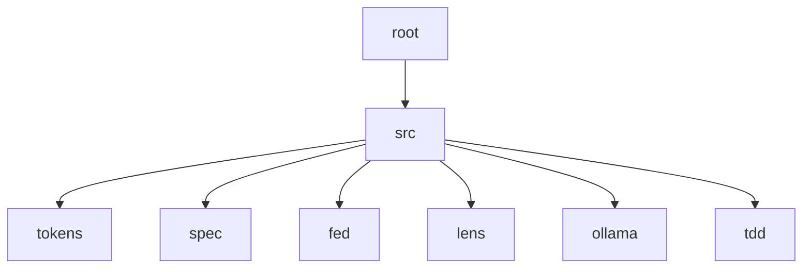

# blackbox

Federated `SPEC.md` for spec-driven development on **local** models — a 20B
running on your own hardware, not a frontier API.

The problem in one number: **itok**, a sibling project, is an 11,291-line
single-crate CLI. Its spec plus its code is **135,096 tokens**. The best
consumer setup measured here — gpt-oss:20b on a 24GB M-series box, full
131,072-token window — leaves **102,529 working tokens** after harness
overhead. A small, disciplined tool already does not fit its own best-case
hardware, before any reasoning happens.

blackbox splits a repo so no single call has to.

## The three axes

Structure is a directory DAG. Every directory may carry a `SPEC.md`
describing itself, and a `§F` table naming its children:

```
dir|owns|⊥owns|tokens
```

`owns` decides **descend**. `⊥owns` decides **stop** — and that is the byte
that prevents loading, because absence cannot be proven from a positive
description.

- **horizontal** — directory depth. Root → hub → leaf, one edge at a time.
- **vertical** — detail. Rules inline, rationale by reference. Measured:
  rationale is 80% of a mature `§V`.
- **facet** — concern. impl / tests / spec / setting / human. Measured: about
  half a repo never loads for implementation work.

They compose. Facet alone does not help TDD (81% of a repo still loads);
facet × horizontal brings one node's work to about 6%.

## Architecture

Generated from the `§F` tables by `bbx graph` — never hand-drawn, so it
cannot drift from what the specs declare.

```
.
`-- src
    |-- tokens
    |-- spec
    |-- fed
    |-- lens
    |-- ollama
    `-- tdd
```

The same graph as mermaid, for viewers that render it:



What each node owns, and — more usefully — what it does not, so a reader
knows when to stop looking. Also generated, by `bbx graph --table`:

| node | owns | does not own |
|---|---|---|
| `src` | code nodes — tokens, spec, fed, lens facades & logic | inference harness, endpoint config |
| `src/tokens` | `itok` facade, counts w/ method label, entry cost, working budget | spec structure, federation edges |
| `src/spec` | `microlith` facade, §-section split, structural check, fmt | token counts, `§F`/`§N` |
| `src/fed` | `§F` parse, edges, chain root→node, `SPEC.md` discovery | counting, rendering |
| `src/lens` | pack assembly, depth `rule`\|`why`, budget verdict | parsing, counting internals |
| `src/ollama` | local endpoint client, `num_ctx`, fence extraction | prompt construction, loop control |
| `src/tdd` | red→judge→green→gate→repair loop, source region edits | HTTP, token counting |
## What is measured

Every number here came from running something, and several corrected an
earlier belief. `§R` in `SPEC.md` carries the full log with sources.

| finding | measurement |
|---|---|
| decomposition bounds the **max call** | 2.1x at 1.1k impl tokens, 2.9x at 5.2k — widens with node size |
| it does **not** cut total tokens | 8.5k–12.9k decomposed vs 9.0k monolith; retries dominate |
| it does **not** improve quality | when the monolith succeeds, output is equivalent |
| success rate | monolith 1/3, decomposed 3/3 |
| prefill dominates | 83% of wall clock at 28k tokens |
| identical prefix is cached | 4.60s → 0.04s |
| an edit invalidates everything after it | tail edit 0.49s, head edit 4.61s |
| caveman encoding saves | **22%**, not the 75% claimed upstream |
| `bytes/4` underestimates caveman text | by 48% — never gate on it |

Hardware, measured on both boxes:

| | M1 Pro 32GB | M5 Pro 24GB |
|---|---|---|
| gpt-oss:20b, full 131,072 ctx | yes, 100% GPU | yes, 100% GPU |
| prefill @ 28k | 284 tok/s | 940 tok/s |
| decode | 24 tok/s | 52 tok/s |
| 28k cold → cached | 111.9s → 11.5s | 37.6s → 5.4s |

Capability is identical; the M1 Pro is ~3x slower at prefill and ~2x at
decode. Federation is worth *more* on the slower machine.

## Use

```sh
cargo build                      # deps: ../itok, ../microlith (path deps)
export BBX_ENDPOINT=http://your-box:11434
export BBX_MODEL=gpt-oss:20b

bbx budget                       # token cost of every node
bbx lens src/fed                 # the context pack for one node
bbx graph                        # this diagram
bbx check                        # microlith structural check, every node
bbx tdd src/fed V2 "<task>"      # red → judge → green → gate → repair
bbx oneshot src/fed V2 "<task>"  # the monolith arm, for comparison
```

`bbx tdd` runs five kinds of call, each with a deliberately narrow context:

1. **red test** — spec rules + public signatures + existing tests. Not the bodies.
2. **judge** — the invariant, the test, and the data model. Never the implementation.
3. **green** — the failing test + signatures + the *call contract* extracted from the test.
4. **gate** — `cargo test` + structural check. Local, deterministic, **zero tokens**.
5. **repair** — capped, and structurally unable to touch the test.

## What was learned the hard way

Three independent times, the fix was a *smaller, more precise context* — never
a better prompt:

- Sending a 182-token slice of `FORMAT.md` instead of the whole 892-token file.
- Extracting the calls a test makes and handing them to the implementer as a
  contract. This fixed a name mismatch **and** three unrelated defects, because
  the signature constrained the design.
- Giving the implementer **signatures instead of bodies**. Shown `edges()`'s
  full body, the model imitated its parsing loop twice on independent tasks;
  shown only the interface, it composed — five lines instead of thirty.

Asking for good behaviour failed both times it was tried. One attempt produced
code that stripped path separators out of the data at parse time so the
violation would disappear.

## Status

Early. `budget`, `lens`, `fed`, `graph`, `check`, `ask`, `tdd` and `oneshot`
work. `route`, `split`, `sync`, `validate`, `SPEC.why.md` and the file ceilings
are specced and unbuilt. `§F`/`§N` are extensions microlith cannot yet parse —
they need to go upstream rather than fork the format.

Two LLM-authored functions live in `src/fed/`, written by gpt-oss:20b through
`bbx tdd`, with their defects recorded in that node's `§B` rather than smoothed
over.

## Reading the specs

`SPEC.md` files are caveman-encoded — symbols are load-bearing. The key is in
`src/tdd/notation.txt`, vendored from `FORMAT.md`:

```
→ leads to    ∴ therefore    ∀ for all    ! must
⊥ never       ? optional     ≤ at most    ∈ in
```

Sections run `§G` goal · `§C` constraints · `§I` interfaces · `§R` research ·
`§V` invariants · `§T` tasks · `§B` bugs. `§R` and `§B` are where the evidence
lives.

## License

MIT.
