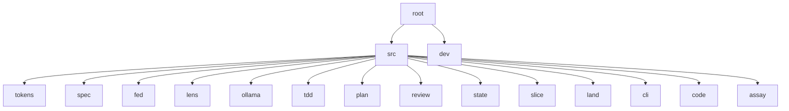

# blackbox

<!-- BEGIN badges -->
[](LICENSE)
[](Cargo.toml)
[](Cargo.toml)
[](docs/THIRD-PARTY-NOTICES.md)
[](Cargo.toml)

[](hk.pkl)
[](hk.pkl)
[](.coverage)
[](.lint-debt)
[](SPEC.md)

[](flake.nix)
[](flake.lock)
[](.github/workflows/ci.yml)
[](.github/workflows/ci.yml)
[](.github/workflows/ci.yml)
[](.github/workflows/ci.yml)

[](https://claude.com/claude-code)
[](https://www.anthropic.com/claude)
[](SPEC.md)
<!-- END badges -->

> ### Built by an LLM, deliberately and in the open
>
> This repository — code, spec, tests and prose — was written by [Claude Code](https://claude.com/claude-code) running Anthropic's **Claude Opus 5**. 189 of 215 commits carry a `Co-Authored-By: Claude Opus 5` trailer. A human owns every decision, reviews every diff, and is accountable for what ships.
>
> **Two of the functions here were written by the 20B this project is about.** `src/fed/` contains work authored by gpt-oss:20b through `bbx tdd`, kept with its defects recorded in that node's `§B` rather than smoothed over — because a tool that claims small models can build software has to show what happens when one does.
>
> **The method is spec-driven development, federated.** [`SPEC.md`](SPEC.md) is the law rather than a description written afterwards, and there are seventeen of them: one per node, each owning the rules for its own directory. 88 `§B` rows across the tree record every defect found so far paired with the rule that now catches it. A rule and its checker land in the same commit, because a rule with no runner is a comment (§V74).
>
> **The guardrails are git hooks that also run on CI.** Entering the dev shell (`nix develop`, or `direnv allow`) installs `pre-commit` and `pre-push`, which run [hk](https://github.com/jdx/hk) against one definition of the gate in [`hk.pkl`](hk.pkl) — 23 steps on commit, 24 on push, the slow one being coverage. [`ci.yml`](.github/workflows/ci.yml) calls that same definition on three platforms, so a laptop and a runner cannot disagree. The architecture diagram below is `bbx graph` output for the same reason: generated from the `§F` tables, so it cannot drift from what the specs declare.
>
> **The record is deliberately unflattering.** `§B12` records that `AGENTS.md` says "never commit to `main`", that nothing enforced it, and that ~20 commits landed on `main` in one session anyway — the rule was read by the agent it governs and still lost to convenience. `§B4` records a "95x" improvement claimed across six commit messages that measured 2.1x against a denominator anyone would actually use.
>
> Deeper: [`AGENTS.md`](AGENTS.md) is the working guide · [`CONTRIBUTING.md`](docs/CONTRIBUTING.md) is the loop · [`SPEC.md`](SPEC.md) is the law and the backlog.

Federated `SPEC.md` for spec-driven development on **local** models — a 20B
running on your own hardware, not a frontier API.

The problem in one number: **itok**, a sibling project, is an 11,332-line
single-crate CLI. Its spec plus its code is **136,811 tokens**. The best
consumer setup measured here — gpt-oss:20b on a 24GB M-series box, full
131,072-token window — leaves **102,529 working tokens** after harness
overhead. A small, disciplined tool already does not fit its own best-case
hardware, before any reasoning happens.

blackbox splits a repo so no single call has to.

## The three axes

Structure is a directory DAG. Every directory may carry a `SPEC.md`
describing itself, and a `§F` table naming its children:

```
dir|owns|⊥owns|tokens
```

`owns` decides **descend**. `⊥owns` decides **stop** — and that is the byte
that prevents loading, because absence cannot be proven from a positive
description.

- **horizontal** — directory depth. Root → hub → leaf, one edge at a time.
- **vertical** — detail. Rules inline, rationale by reference. Measured:
  rationale is 80% of a mature `§V`.
- **facet** — concern. impl / tests / spec / setting / human. Measured: about
  half a repo never loads for implementation work.

They compose. Facet alone does not help TDD (81% of a repo still loads);
facet × horizontal brings one node's work to about 6%.

## Architecture

Generated from the `§F` tables by `bbx graph`, spliced in by `bbx-dev readme`
and checked by the gate -- so it cannot drift from what the specs declare. It
did drift, for as long as nothing regenerated it, and `§B16` records the nine
nodes it was missing while this sentence claimed otherwise.

<!-- BEGIN graph-tree -->
```
.
|-- src
|   |-- tokens
|   |-- spec
|   |-- fed
|   |-- lens
|   |-- ollama
|   |-- tdd
|   |-- plan
|   |-- review
|   |-- state
|   |-- slice
|   |-- land
|   |-- cli
|   |-- code
|   `-- assay
`-- dev
```
<!-- END graph-tree -->

The same graph as mermaid, for viewers that render it:

<!-- BEGIN graph-mermaid -->

<!-- END graph-mermaid -->

What each node owns, and — more usefully — what it does not, so a reader
knows when to stop looking. Also generated, by `bbx graph --table`:

<!-- BEGIN graph-table -->
| node | owns | does not own |
|---|---|---|
| `src` | code nodes — tokens, spec, fed, lens facades & logic | inference harness, endpoint config |
| `dev` | repo-maintaining tooling, `publish = false` — README generation | anything a consumer installs |
| `src/tokens` | `itok` facade, counts w/ method label, entry cost, working budget | spec structure, federation edges |
| `src/spec` | `microlith` facade, §-section split, structural check, fmt | token counts, `§F`/`§N` |
| `src/fed` | `§F` parse, edges, chain root→node, `SPEC.md` discovery | counting, rendering |
| `src/lens` | pack assembly, depth `rule`\|`why`, budget verdict | parsing, counting internals |
| `src/ollama` | local endpoint client, `num_ctx`, fence extraction | prompt construction, loop control |
| `src/tdd` | red→judge→green→gate→repair loop, source region edits | HTTP, token counting |
| `src/plan` | open `§T` rows, horizon, confidence, `apply` one step | writing code, judging it |
| `src/review` | mechanical checks on what `apply` committed | reading the diff, judging intent |
| `src/state` | one idempotent cached store — pace, telemetry, applied rows | everything else |
| `src/slice` | distil a document to the part needed to ACT, generated | judging what the slice says |
| `src/land` | run branch → `main` when believability earns it | writing code, judging it, reading the diff |
| `src/cli` | arg dispatch, usage, exit codes | every verb's logic |
| `src/code` | read Rust source as text — split, public fns, call detection, signatures | judging what it reads, `SPEC.md` structure |
| `src/assay` | a corpus + a compiler grader — measure WHETHER the model can, ⊥ make it | writing code with a model, judging a diff |
<!-- END graph-table -->

## What is measured

Every number here came from running something, and several corrected an
earlier belief. `§R` in `SPEC.md` carries the full log with sources.

| finding | measurement |
|---|---|
| decomposition bounds the **max call** | 2.1x at 1.1k impl tokens, 2.9x at 5.2k — widens with node size |
| it does **not** cut total tokens | 8.5k–12.9k decomposed vs 9.0k monolith; retries dominate |
| it does **not** improve quality | when the monolith succeeds, output is equivalent |
| success rate | monolith 1/3, decomposed 3/3 |
| prefill dominates | 83% of wall clock at 28k tokens |
| identical prefix is cached | 4.60s → 0.04s |
| an edit invalidates everything after it | tail edit 0.49s, head edit 4.61s |
| caveman encoding saves | **22%**, not the 75% claimed upstream |
| `bytes/4` underestimates caveman text | by 48% — never gate on it |

Hardware, measured on both boxes:

| | M1 Pro 32GB | M5 Pro 24GB |
|---|---|---|
| gpt-oss:20b, full 131,072 ctx | yes, 100% GPU | yes, 100% GPU |
| prefill @ 28k | 284 tok/s | 940 tok/s |
| decode | 24 tok/s | 52 tok/s |
| 28k cold → cached | 111.9s → 11.5s | 37.6s → 5.4s |

Capability is identical; the M1 Pro is ~3x slower at prefill and ~2x at
decode. Federation is worth *more* on the slower machine.

## Install

Not on crates.io yet, and this section will say `cargo install bbx-cli` the
day it is. Until then:

```sh
nix develop            # the pinned toolchain, hk, and bbx on PATH
cargo build --release  # or build it yourself; every dep is from crates.io
```

`bbx` needs no endpoint for the deterministic verbs — `budget`, `lens`,
`fed`, `graph`, `check`, `review`, `slice`, `plan` are pure functions of your
tree and never call a model. Only `ask`, `tdd` and `oneshot` do, and they
need an Ollama-compatible endpoint you point at yourself.

## Use

```sh
cargo build                      # every dep from crates.io; no sibling checkout
export BBX_ENDPOINT=http://your-box:11434
export BBX_MODEL=gpt-oss:20b

bbx budget                       # token cost of every node
bbx lens src/fed                 # the context pack for one node
bbx graph                        # this diagram
bbx check                        # microlith structural check, every node
bbx tdd src/fed V2 "<task>"      # red → judge → green → gate → repair
bbx oneshot src/fed V2 "<task>"  # the monolith arm, for comparison
```

`bbx tdd` runs five kinds of call, each with a deliberately narrow context:

1. **red test** — spec rules + public signatures + existing tests. Not the bodies.
2. **judge** — the invariant, the test, and the data model. Never the implementation.
3. **green** — the failing test + signatures + the *call contract* extracted from the test.
4. **gate** — `cargo test` + structural check. Local, deterministic, **zero tokens**.
5. **repair** — capped, and structurally unable to touch the test.

## Exit codes

A contract, because scripts read them, and the same three for every verb:

| code | meaning |
|---|---|
| `0` | clean — nothing to report |
| `1` | a violation: a chain over its ceiling, a structural finding, a drifted slice |
| `2` | usage — a verb, flag or argument that does not exist |

A refusal is not a crash. `bbx budget` exiting `1` is the gate working.

## Use it as a library

The binary is a shim over a lib, and the lib is what a hook or another tool
should call rather than parsing our output:

```rust
use std::path::Path;

let root = Path::new(".");
let pack = bbx::lens::pack(root, &root.join("src/fed"), bbx::lens::Depth::Rule)?;
let ceiling = bbx::lens::ceiling_for(root, &root.join("src/fed"))?;
let nodes = bbx::fed::discover(root);
# Ok::<(), Box<dyn std::error::Error>>(())
```

`bbx-dev`, this repository's own tooling, is the first consumer of that lib —
it counts nodes with `fed::discover` rather than walking the tree a second
time.

## Guarantees

- **The deterministic core never calls a model.** Parsing, the DAG, budgets
  and ceilings are pure Rust. `--no-default-features` is meant to prove it by
  building without the endpoint at all — and `§B15` records that this
  configuration is currently broken, which is exactly the kind of claim this
  section is supposed to be checkable against.
- **Generated output is generated, not maintained.** The architecture diagram
  comes from `bbx graph`, the badge block from `bbx-dev badges`, the
  distilled slices from `bbx slice --check`. A drifted slice fails the gate.
- **The gate is one definition.** [`hk.pkl`](hk.pkl) declares every step;
  hooks and [CI](.github/workflows/ci.yml) both run that file, on three
  platforms.
- **Ratchets have a direction.** Coverage may only rise, lint debt may only
  fall, and the gate refuses a commit that records a raise rather than paying
  it.
- **What it cannot do is written down.** The Status section below names the
  verbs that are specced and unbuilt, and `§B` names every defect found so
  far. Neither list is curated for how it reads.

## What was learned the hard way

Three independent times, the fix was a *smaller, more precise context* — never
a better prompt:

- Sending a 182-token slice of `FORMAT.md` instead of the whole 892-token file.
- Extracting the calls a test makes and handing them to the implementer as a
  contract. This fixed a name mismatch **and** three unrelated defects, because
  the signature constrained the design.
- Giving the implementer **signatures instead of bodies**. Shown `edges()`'s
  full body, the model imitated its parsing loop twice on independent tasks;
  shown only the interface, it composed — five lines instead of thirty.

Asking for good behaviour failed both times it was tried. One attempt produced
code that stripped path separators out of the data at parse time so the
violation would disappear.

## Status

Early. `budget`, `lens`, `fed`, `graph`, `check`, `ask`, `tdd` and `oneshot`
work. `route`, `split`, `sync`, `validate`, `SPEC.why.md` and the file ceilings
are specced and unbuilt. `§F`/`§N` are extensions microlith cannot yet parse —
they need to go upstream rather than fork the format.

Two LLM-authored functions live in `src/fed/`, written by gpt-oss:20b through
`bbx tdd`, with their defects recorded in that node's `§B` rather than smoothed
over.

## The name

A **black box** is the thing you cannot see inside. That is the ordinary
complaint about a language model, and it is not the sense meant here.

A flight recorder is also a black box, and it is the opposite: the one
component built so that afterwards you can say exactly what happened. It
survives the crash on purpose. `§B` in every `SPEC.md` is that recorder —
fourteen entries at the root, each a defect paired with the rule that now
catches it, kept whether or not it flatters the project.

The third sense is the working one. In control theory a black box is a system
you can only characterise from outside, by what you feed it and what comes
back. A 20B model with a 131,072-token window is precisely that: you cannot
inspect its reasoning, so the only thing you can engineer is what goes in.
This tool engineers what goes in.

## Reading the specs

`SPEC.md` files are caveman-encoded — symbols are load-bearing. The key is in
`src/tdd/notation.txt`, vendored from `FORMAT.md`:

```
→ leads to    ∴ therefore    ∀ for all    ! must
⊥ never       ? optional     ≤ at most    ∈ in
```

Sections run `§G` goal · `§C` constraints · `§I` interfaces · `§R` research ·
`§V` invariants · `§T` tasks · `§B` bugs. `§R` and `§B` are where the evidence
lives.

## Changelog

[CHANGELOG.md](CHANGELOG.md), in [Keep a Changelog](https://keepachangelog.com)
form. Pre-`1.0` a minor bump may change behaviour; what is built and what is
merely specced is in Status above rather than implied by the version number.

## Contributing

- [docs/CONTRIBUTING.md](docs/CONTRIBUTING.md) — setup, the loop, and the one
  hard rule
- [docs/CODE_OF_CONDUCT.md](docs/CODE_OF_CONDUCT.md)
- [AGENTS.md](AGENTS.md) — the working guide, for agents and humans alike

## Security

`blackbox` runs `git` and `cargo test` under model direction, and sends slices
of your repository to the endpoint you name. Report privately rather than in a
public issue — see [docs/SECURITY.md](docs/SECURITY.md), which states the
surface plainly.

Set `BBX_ENDPOINT` to an `https://` URL when the endpoint is not a machine you
own; TLS is compiled in.

## License

MIT — see [LICENSE](LICENSE).

Two documents are vendored rather than written here, and both are
acknowledged in
[docs/THIRD-PARTY-NOTICES.md](docs/THIRD-PARTY-NOTICES.md): `FORMAT.md` from
cavekit, and `vendor/principles/` from set-and-setting.
